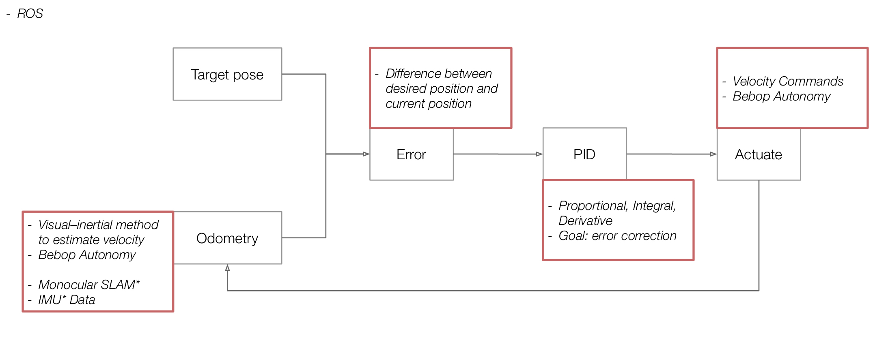

# Parrot Bebop 2 Controller

This code represents parrot bebop 2.0 PID controller ROS package using way points, based on Bebop's built-in visual-inertial odometry.
In this project a controller was developed for Parrot bebop 2.0 drone, in order to navigate autonomously to the users desired locations and collect data from the environment, such as object recognition, photogrammetry, etc.


__Workflow:__


- Target Pose is read from `scripts/way_points.py` file. which is a list of 3d points in space that is our desired path for navigation.
- Current Pose of the drone is calculated using on-board sensory data from bebop_autonomy driver.
- The error vector, the difference between target position and current position is calculated:


- The PID controller takes the error as input and generates the correction vector in order to reduce the error.
- The correction vector is sent to drone as new Velocity Commands, using bebop_autonomy driver.


## Requirements
* ROS Indigo, Jade or Kinetic (Only tested on Ubuntu 16.04)
* Basic familiarity with building ROS packages
* Parrot Bebop 2.0


## Getting started
You can start using the package by adding it to your conventional ROS catkin workspace:

```
cd ~/catkin_ws/src
git clone https://github.com/Coroush/bebop_control.git
cd ..
catkin_make
catkin_make install
```
Please note that this package makes use of [bebop_autonomy](http://wiki.ros.org/bebop_autonomy), so please install this package in advance and make sure that example launch files from those packages can be run correctly on your computer. Once that is done, you can try using `bebop_control` by running `bebop_autonomy` driver and the `bebop_position_controller.py` python script.

Should be run in two different terminal windows.
```
roslaunch bebop_driver bebop_node.launch
python <package_directory>/scripts/bebop_position_controller.py
```

__Keyboard Interface:__
After running the python code, you can use the keys below to send commands to bebop.

| Key          |Command     |
| ------------- | -------------- |
| ESC  | Emergency Stop |
| t | Take off |
| l | Land |
| n | Go to navigation mode (following the way points) |
| s | Stop |

## Future Developments
- Extract yaw from the orientation quaternion in Odometry to be able to control this as well.
- Deal with global/local. If we are outdoors, at any time we will have GPS position of the drone, but our controller is local. We will need to write a node to convert global coordinates from a setpoint or flight_plan into local coordinates (if needed)

## References
- [Parrot Bebop Controller on Iaac Blog](http://www.iaacblog.com/programs/parrot-bebop-controller/)


## Credits
__Parrot Bebop Controller__ is a project of IaaC, Institute for Advanced Architecture of Catalonia, Developed at __Master in Robotics and Advanced Construction (MRAC)__ in __2018-2019__ by:

Students: __Soroush Garivani, Jean-Nicolas Dackiw, Andrzej Foltman, Filip Bielicki__

Faculty: __Daniel Serrano Lopez, Starsky Lara__
